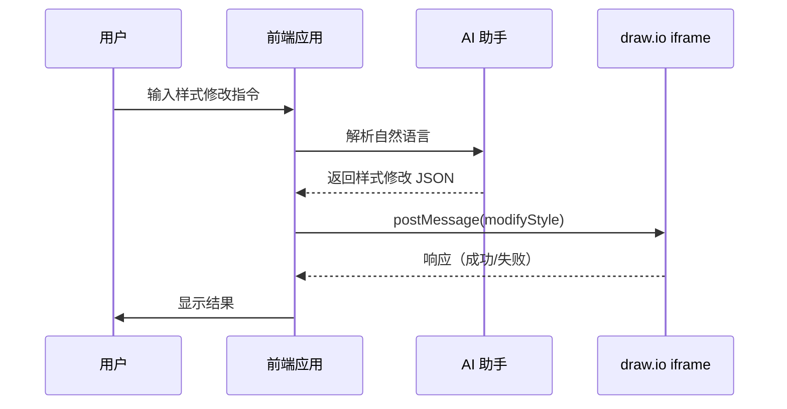

# 样式修改 iframe 集成指南

## 概述

本指南将帮助您将 draw.io 的样式修改 iframe 集成功能集成到您的前端应用中。通过这个功能，您可以让 AI 助手或前端系统通过简单的 JSON 消息自动修改图形元素的样式，无需用户手动操作。

## 集成流程



## 快速开始

### 步骤 1：嵌入 draw.io iframe

在您的 HTML 页面中添加 draw.io iframe：

```html
<!DOCTYPE html>
<html>
<head>
    <title>我的应用 - 样式修改</title>
</head>
<body>
    <iframe 
        id="drawio-iframe"
        src="https://app.diagrams.net/?embed=1&proto=json"
        width="100%" 
        height="600"
        frameborder="0">
    </iframe>
</body>
</html>
```

**重要参数说明**：
- `embed=1`：启用嵌入模式
- `proto=json`：启用 JSON 协议

### 步骤 2：添加消息监听器

监听来自 draw.io 的响应消息：

```javascript
window.addEventListener('message', function(evt) {
    const iframe = document.getElementById('drawio-iframe');
    if (evt.source !== iframe.contentWindow) {
        return;
    }
    
    let data;
    try {
        data = typeof evt.data === 'string' ? JSON.parse(evt.data) : evt.data;
    } catch (e) {
        console.error('无法解析消息：', e);
        return;
    }
    
    if (data.event === 'modifyStyle') {
        if (data.status === 'ok') {
            console.log('操作成功！修改了', data.data.modifiedCount, '个元素');
        } else {
            console.error('样式修改失败：', data.error);
        }
    }
});
```

### 步骤 3：发送样式修改请求

```javascript
function changeSelectedColor(color) {
    const iframe = document.getElementById('drawio-iframe');
    
    iframe.contentWindow.postMessage(JSON.stringify({
        action: 'modifyStyle',
        target: 'selected',
        styles: {
            fillColor: color
        }
    }), '*');
}

// 使用示例
changeSelectedColor('#FF0000');
```

## 完整示例

### HTML + Vanilla JavaScript


```html
<!DOCTYPE html>
<html lang="zh-CN">
<head>
    <meta charset="UTF-8">
    <meta name="viewport" content="width=device-width, initial-scale=1.0">
    <title>Draw.io 样式修改集成示例</title>
    <style>
        body {
            font-family: Arial, sans-serif;
            margin: 0;
            padding: 20px;
        }
        .container {
            max-width: 1200px;
            margin: 0 auto;
        }
        .controls {
            margin-bottom: 20px;
            padding: 15px;
            background: #f5f5f5;
            border-radius: 4px;
        }
        .control-group {
            margin-bottom: 15px;
        }
        label {
            display: inline-block;
            width: 120px;
            font-weight: bold;
        }
        button {
            padding: 8px 16px;
            margin: 5px;
            font-size: 14px;
            background-color: #007bff;
            color: white;
            border: none;
            border-radius: 4px;
            cursor: pointer;
        }
        button:hover {
            background-color: #0056b3;
        }
        .status {
            margin-top: 10px;
            padding: 10px;
            border-radius: 4px;
        }
        .status.success {
            background-color: #d4edda;
            color: #155724;
        }
        .status.error {
            background-color: #f8d7da;
            color: #721c24;
        }
        input[type="color"] {
            width: 50px;
            height: 30px;
            border: none;
            cursor: pointer;
        }
        iframe {
            border: 1px solid #ccc;
            border-radius: 4px;
        }
    </style>
</head>
<body>
    <div class="container">
        <h1>Draw.io 样式修改集成示例</h1>
        
        <div class="controls">
            <h2>样式控制</h2>
            
            <div class="control-group">
                <label>目标选择：</label>
                <select id="target-select">
                    <option value="selected">选中的元素</option>
                    <option value="edges">所有边</option>
                    <option value="vertices">所有顶点</option>
                    <option value="all">所有元素</option>
                </select>
            </div>
            
            <div class="control-group">
                <label>填充颜色：</label>
                <input type="color" id="fill-color" value="#FF0000">
                <button onclick="applyFillColor()">应用</button>
            </div>
            
            <div class="control-group">
                <label>边框颜色：</label>
                <input type="color" id="stroke-color" value="#0000FF">
                <button onclick="applyStrokeColor()">应用</button>
            </div>
            
            <div class="control-group">
                <label>快速操作：</label>
                <button onclick="thickenLines()">加粗线条</button>
                <button onclick="addShadow()">添加阴影</button>
                <button onclick="makeRounded()">圆角化</button>
                <button onclick="increaseFontSize()">增大字体</button>
            </div>
            
            <div id="status"></div>
        </div>
        
        <h2>Draw.io 画布</h2>
        <iframe 
            id="drawio-iframe"
            src="https://app.diagrams.net/?embed=1&proto=json"
            width="100%" 
            height="600"
            frameborder="0">
        </iframe>
    </div>

    <script>
        const iframe = document.getElementById('drawio-iframe');
        const statusDiv = document.getElementById('status');
        
        window.addEventListener('message', function(evt) {
            if (evt.source !== iframe.contentWindow) {
                return;
            }
            
            let data;
            try {
                data = typeof evt.data === 'string' ? JSON.parse(evt.data) : evt.data;
            } catch (e) {
                return;
            }
            
            if (data.event === 'modifyStyle') {
                if (data.status === 'ok') {
                    showStatus('success', `✓ 操作成功！修改了 ${data.data.modifiedCount} 个元素`);
                } else {
                    showStatus('error', `✗ 错误：${data.error} (代码: ${data.errorCode})`);
                }
            }
        });
        
        function getTarget() {
            return document.getElementById('target-select').value;
        }
        
        function sendStyleMessage(message) {
            iframe.contentWindow.postMessage(JSON.stringify(message), '*');
        }
        
        function applyFillColor() {
            const color = document.getElementById('fill-color').value;
            sendStyleMessage({
                action: 'modifyStyle',
                target: getTarget(),
                styles: { fillColor: color }
            });
        }
        
        function applyStrokeColor() {
            const color = document.getElementById('stroke-color').value;
            sendStyleMessage({
                action: 'modifyStyle',
                target: getTarget(),
                styles: { strokeColor: color }
            });
        }
        
        function thickenLines() {
            sendStyleMessage({
                action: 'modifyStyle',
                target: getTarget(),
                operations: {
                    strokeWidth: { op: 'increase', value: 2 }
                }
            });
        }
        
        function addShadow() {
            sendStyleMessage({
                action: 'modifyStyle',
                target: getTarget(),
                styles: { shadow: 1 }
            });
        }
        
        function makeRounded() {
            sendStyleMessage({
                action: 'modifyStyle',
                target: getTarget(),
                styles: { rounded: 1 }
            });
        }
        
        function increaseFontSize() {
            sendStyleMessage({
                action: 'modifyStyle',
                target: getTarget(),
                operations: {
                    fontSize: { op: 'increase', value: 4 }
                }
            });
        }
        
        function showStatus(type, message) {
            statusDiv.className = 'status ' + type;
            statusDiv.textContent = message;
            statusDiv.style.display = 'block';
        }
    </script>
</body>
</html>
```

### React 集成

```jsx
import React, { useRef, useEffect, useState } from 'react';

function DrawioStyleModification() {
    const iframeRef = useRef(null);
    const [target, setTarget] = useState('selected');
    const [fillColor, setFillColor] = useState('#FF0000');
    const [strokeColor, setStrokeColor] = useState('#0000FF');
    const [status, setStatus] = useState({ type: '', message: '' });

    useEffect(() => {
        const handleMessage = (evt) => {
            if (evt.source !== iframeRef.current?.contentWindow) {
                return;
            }

            let data;
            try {
                data = typeof evt.data === 'string' ? JSON.parse(evt.data) : evt.data;
            } catch (e) {
                return;
            }

            if (data.event === 'modifyStyle') {
                if (data.status === 'ok') {
                    setStatus({
                        type: 'success',
                        message: `✓ 操作成功！修改了 ${data.data.modifiedCount} 个元素`
                    });
                } else {
                    setStatus({
                        type: 'error',
                        message: `✗ 错误：${data.error} (代码: ${data.errorCode})`
                    });
                }
            }
        };

        window.addEventListener('message', handleMessage);
        return () => window.removeEventListener('message', handleMessage);
    }, []);

    const sendStyleMessage = (message) => {
        iframeRef.current?.contentWindow.postMessage(JSON.stringify(message), '*');
    };

    const applyFillColor = () => {
        sendStyleMessage({
            action: 'modifyStyle',
            target,
            styles: { fillColor }
        });
    };

    const applyStrokeColor = () => {
        sendStyleMessage({
            action: 'modifyStyle',
            target,
            styles: { strokeColor }
        });
    };

    const thickenLines = () => {
        sendStyleMessage({
            action: 'modifyStyle',
            target,
            operations: {
                strokeWidth: { op: 'increase', value: 2 }
            }
        });
    };

    const addShadow = () => {
        sendStyleMessage({
            action: 'modifyStyle',
            target,
            styles: { shadow: 1 }
        });
    };

    return (
        <div style={{ padding: '20px', maxWidth: '1200px', margin: '0 auto' }}>
            <h1>Draw.io 样式修改集成示例</h1>
            
            <div style={{ marginBottom: '20px', padding: '15px', background: '#f5f5f5', borderRadius: '4px' }}>
                <h2>样式控制</h2>
                
                <div style={{ marginBottom: '15px' }}>
                    <label style={{ display: 'inline-block', width: '120px', fontWeight: 'bold' }}>
                        目标选择：
                    </label>
                    <select value={target} onChange={(e) => setTarget(e.target.value)}>
                        <option value="selected">选中的元素</option>
                        <option value="edges">所有边</option>
                        <option value="vertices">所有顶点</option>
                        <option value="all">所有元素</option>
                    </select>
                </div>
                
                <div style={{ marginBottom: '15px' }}>
                    <label style={{ display: 'inline-block', width: '120px', fontWeight: 'bold' }}>
                        填充颜色：
                    </label>
                    <input 
                        type="color" 
                        value={fillColor} 
                        onChange={(e) => setFillColor(e.target.value)}
                        style={{ width: '50px', height: '30px', border: 'none', cursor: 'pointer' }}
                    />
                    <button onClick={applyFillColor} style={{ marginLeft: '10px' }}>应用</button>
                </div>
                
                <div style={{ marginBottom: '15px' }}>
                    <label style={{ display: 'inline-block', width: '120px', fontWeight: 'bold' }}>
                        边框颜色：
                    </label>
                    <input 
                        type="color" 
                        value={strokeColor} 
                        onChange={(e) => setStrokeColor(e.target.value)}
                        style={{ width: '50px', height: '30px', border: 'none', cursor: 'pointer' }}
                    />
                    <button onClick={applyStrokeColor} style={{ marginLeft: '10px' }}>应用</button>
                </div>
                
                <div style={{ marginBottom: '15px' }}>
                    <label style={{ display: 'inline-block', width: '120px', fontWeight: 'bold' }}>
                        快速操作：
                    </label>
                    <button onClick={thickenLines}>加粗线条</button>
                    <button onClick={addShadow}>添加阴影</button>
                </div>
                
                {status.message && (
                    <div style={{
                        marginTop: '10px',
                        padding: '10px',
                        borderRadius: '4px',
                        backgroundColor: status.type === 'success' ? '#d4edda' : '#f8d7da',
                        color: status.type === 'success' ? '#155724' : '#721c24'
                    }}>
                        {status.message}
                    </div>
                )}
            </div>
            
            <h2>Draw.io 画布</h2>
            <iframe
                ref={iframeRef}
                src="https://app.diagrams.net/?embed=1&proto=json"
                width="100%"
                height="600"
                frameBorder="0"
                style={{ border: '1px solid #ccc', borderRadius: '4px' }}
            />
        </div>
    );
}

export default DrawioStyleModification;
```

## 高级用法

### 1. 组合多个样式属性

```javascript
// 一次性应用多个样式
iframe.contentWindow.postMessage(JSON.stringify({
    action: 'modifyStyle',
    target: 'selected',
    styles: {
        fillColor: '#0000FF',
        strokeColor: '#FFFFFF',
        strokeWidth: 3,
        rounded: 1,
        shadow: 1,
        fontColor: '#FFFFFF'
    }
}), '*');
```

### 2. 使用相对操作

```javascript
// 增加线条粗细
iframe.contentWindow.postMessage(JSON.stringify({
    action: 'modifyStyle',
    target: 'edges',
    operations: {
        strokeWidth: { op: 'increase', value: 2 }
    }
}), '*');

// 减少透明度
iframe.contentWindow.postMessage(JSON.stringify({
    action: 'modifyStyle',
    target: 'selected',
    operations: {
        opacity: { op: 'decrease', value: 20 }
    }
}), '*');

// 放大字体
iframe.contentWindow.postMessage(JSON.stringify({
    action: 'modifyStyle',
    target: 'vertices',
    operations: {
        fontSize: { op: 'multiply', value: 1.5 }
    }
}), '*');
```

### 3. 混合绝对值和相对操作

```javascript
// 先设置颜色，再调整大小
iframe.contentWindow.postMessage(JSON.stringify({
    action: 'modifyStyle',
    target: 'selected',
    styles: {
        fillColor: '#FF0000',
        strokeColor: '#000000'
    },
    operations: {
        strokeWidth: { op: 'multiply', value: 2 },
        fontSize: { op: 'increase', value: 4 }
    }
}), '*');
```

### 4. 修改箭头样式

```javascript
// 设置边的箭头
iframe.contentWindow.postMessage(JSON.stringify({
    action: 'modifyStyle',
    target: 'edges',
    styles: {
        endArrow: 'classic',
        endSize: 10,
        endFill: 1,
        startArrow: 'none'
    }
}), '*');
```

### 5. 应用主题样式

```javascript
// 深色主题
function applyDarkTheme() {
    // 修改所有顶点
    iframe.contentWindow.postMessage(JSON.stringify({
        action: 'modifyStyle',
        target: 'vertices',
        styles: {
            fillColor: '#2C2C2C',
            strokeColor: '#FFFFFF',
            fontColor: '#FFFFFF'
        }
    }), '*');
    
    // 修改所有边
    setTimeout(() => {
        iframe.contentWindow.postMessage(JSON.stringify({
            action: 'modifyStyle',
            target: 'edges',
            styles: {
                strokeColor: '#FFFFFF'
            }
        }), '*');
    }, 100);
}

// 浅色主题
function applyLightTheme() {
    iframe.contentWindow.postMessage(JSON.stringify({
        action: 'modifyStyle',
        target: 'all',
        styles: {
            fillColor: '#FFFFFF',
            strokeColor: '#000000',
            fontColor: '#000000'
        }
    }), '*');
}
```

## AI 助手集成

### 完整 AI 集成示例

```javascript
// AI 助手集成
async function handleUserStyleCommand(userText) {
    try {
        // 1. 调用 AI API 将自然语言转换为样式指令
        const response = await fetch('https://api.example.com/ai/style-command', {
            method: 'POST',
            headers: {
                'Content-Type': 'application/json',
                'Authorization': 'Bearer YOUR_API_KEY'
            },
            body: JSON.stringify({
                text: userText,
                context: 'drawio-style-modification'
            })
        });
        
        if (!response.ok) {
            throw new Error('AI API 调用失败');
        }
        
        const data = await response.json();
        const styleCommand = data.command;
        
        // 2. 验证 AI 返回的指令
        if (!validateStyleCommand(styleCommand)) {
            throw new Error('AI 返回的指令格式无效');
        }
        
        // 3. 发送样式修改指令到 draw.io
        const iframe = document.getElementById('drawio-iframe');
        iframe.contentWindow.postMessage(JSON.stringify(styleCommand), '*');
        
    } catch (error) {
        console.error('AI 样式修改失败：', error);
        alert('样式修改失败：' + error.message);
    }
}

// 验证样式指令
function validateStyleCommand(command) {
    if (!command || typeof command !== 'object') {
        return false;
    }
    
    if (command.action !== 'modifyStyle') {
        return false;
    }
    
    const validTargets = ['selected', 'edges', 'vertices', 'all'];
    if (!validTargets.includes(command.target)) {
        return false;
    }
    
    if (!command.styles && !command.operations) {
        return false;
    }
    
    return true;
}

// 使用示例
const userCommands = [
    '把选中的改成红色',
    '加粗所有连接线',
    '给所有形状添加阴影',
    '把字体放大一倍',
    '把所有边改成虚线'
];

// 处理用户命令
userCommands.forEach(command => {
    handleUserStyleCommand(command);
});
```

### AI 提示词示例

```
系统提示词：
你是一个 draw.io 样式修改助手。用户会用自然语言描述他们想要的样式修改，你需要将其转换为 JSON 格式的样式修改指令。

指令格式：
{
    "action": "modifyStyle",
    "target": "selected" | "edges" | "vertices" | "all",
    "styles": { 属性名: 值 },
    "operations": { 属性名: { "op": "操作类型", "value": 数值 } }
}

可用的样式属性：
- 颜色：fillColor, strokeColor, fontColor
- 数值：strokeWidth, fontSize, opacity
- 开关：dashed, rounded, shadow
- 对齐：align, verticalAlign
- 箭头：startArrow, endArrow, startSize, endSize

可用的操作类型：
- set: 设置为指定值
- increase: 增加指定值
- decrease: 减少指定值
- multiply: 乘以指定倍数

示例：
用户："把选中的改成红色"
输出：{"action":"modifyStyle","target":"selected","styles":{"fillColor":"#FF0000"}}

用户："加粗所有连接线"
输出：{"action":"modifyStyle","target":"edges","operations":{"strokeWidth":{"op":"increase","value":2}}}

用户："给所有形状添加阴影并设置圆角"
输出：{"action":"modifyStyle","target":"vertices","styles":{"shadow":1,"rounded":1}}
```

### AI 响应处理

```javascript
// 处理 AI 响应并应用样式
class AIStyleAssistant {
    constructor(iframeId) {
        this.iframe = document.getElementById(iframeId);
        this.setupMessageListener();
    }
    
    setupMessageListener() {
        window.addEventListener('message', (evt) => {
            if (evt.source !== this.iframe.contentWindow) {
                return;
            }
            
            let data;
            try {
                data = typeof evt.data === 'string' ? JSON.parse(evt.data) : evt.data;
            } catch (e) {
                return;
            }
            
            if (data.event === 'modifyStyle') {
                this.handleStyleResponse(data);
            }
        });
    }
    
    handleStyleResponse(data) {
        if (data.status === 'ok') {
            this.onSuccess(data.data.modifiedCount);
        } else {
            this.onError(data.error, data.errorCode);
        }
    }
    
    async processUserCommand(userText) {
        try {
            // 显示加载状态
            this.onLoading();
            
            // 调用 AI API
            const styleCommand = await this.callAI(userText);
            
            // 应用样式
            this.applyStyle(styleCommand);
            
        } catch (error) {
            this.onError(error.message);
        }
    }
    
    async callAI(userText) {
        const response = await fetch('/api/ai/style', {
            method: 'POST',
            headers: { 'Content-Type': 'application/json' },
            body: JSON.stringify({ text: userText })
        });
        
        if (!response.ok) {
            throw new Error('AI 调用失败');
        }
        
        return await response.json();
    }
    
    applyStyle(command) {
        this.iframe.contentWindow.postMessage(JSON.stringify(command), '*');
    }
    
    onLoading() {
        console.log('正在处理...');
    }
    
    onSuccess(count) {
        console.log(`成功修改了 ${count} 个元素`);
    }
    
    onError(error, code) {
        console.error(`错误：${error}`, code);
    }
}

// 使用示例
const assistant = new AIStyleAssistant('drawio-iframe');
assistant.processUserCommand('把选中的改成蓝色并加粗');
```

## 常见问题和解决方案

### 问题 1：没有目标元素

**症状**：收到 `NO_TARGET_CELLS` 错误

**可能原因**：
1. 使用 `target: 'selected'` 但没有选中任何元素
2. 画布上没有对应类型的元素

**解决方案**：
```javascript
// 在发送前检查是否有选中元素
function checkSelection() {
    // 提示用户选择元素
    alert('请先选择要修改的元素');
}

// 或者改用其他目标
function applyToAll() {
    iframe.contentWindow.postMessage(JSON.stringify({
        action: 'modifyStyle',
        target: 'all',  // 修改所有元素
        styles: { fillColor: '#FF0000' }
    }), '*');
}
```

### 问题 2：颜色属性不支持相对操作

**症状**：收到 `UNSUPPORTED_OPERATION` 错误

**解决方案**：
```javascript
// 错误：对颜色使用相对操作
// ❌ operations: { fillColor: { op: 'increase', value: 10 } }

// 正确：对颜色使用绝对值
// ✓ styles: { fillColor: '#FF0000' }

// 或者对颜色使用 set 操作
// ✓ operations: { fillColor: { op: 'set', value: '#FF0000' } }
```

### 问题 3：值超出范围

**症状**：值被自动限制

**解决方案**：
```javascript
// 系统会自动限制值在有效范围内
// 例如：opacity 范围是 0-100
iframe.contentWindow.postMessage(JSON.stringify({
    action: 'modifyStyle',
    target: 'selected',
    operations: {
        opacity: { op: 'set', value: 150 }  // 会被限制为 100
    }
}), '*');

// 建议：在发送前验证值范围
function clampOpacity(value) {
    return Math.max(0, Math.min(100, value));
}
```

### 问题 4：箭头属性应用于非边元素

**症状**：箭头属性被忽略

**解决方案**：
```javascript
// 箭头属性只对边元素有效
// 使用正确的目标选择器
iframe.contentWindow.postMessage(JSON.stringify({
    action: 'modifyStyle',
    target: 'edges',  // 只选择边
    styles: {
        endArrow: 'classic',
        endSize: 10
    }
}), '*');
```

### 问题 5：枚举值无效

**症状**：收到 `INVALID_VALUE` 错误

**解决方案**：
```javascript
// 使用有效的枚举值
const validAlignValues = ['left', 'center', 'right'];
const validVerticalAlignValues = ['top', 'middle', 'bottom'];

function applyAlignment(align, verticalAlign) {
    if (!validAlignValues.includes(align)) {
        console.error('无效的对齐值：', align);
        return;
    }
    
    iframe.contentWindow.postMessage(JSON.stringify({
        action: 'modifyStyle',
        target: 'selected',
        styles: {
            align: align,
            verticalAlign: verticalAlign
        }
    }), '*');
}
```

## 安全最佳实践

### 1. 限制允许的 Origin

```javascript
// 生产环境配置
const allowedOrigin = 'https://app.example.com';
const iframeSrc = `https://app.diagrams.net/?embed=1&proto=json&allowedOrigins=${encodeURIComponent(allowedOrigin)}`;
```

### 2. 验证用户输入

```javascript
function sanitizeStyleValue(value) {
    // 验证颜色值
    if (typeof value === 'string' && value.startsWith('#')) {
        const hexPattern = /^#[0-9A-Fa-f]{6}$/;
        if (!hexPattern.test(value)) {
            throw new Error('无效的颜色值');
        }
    }
    
    // 验证数值
    if (typeof value === 'number') {
        if (!isFinite(value)) {
            throw new Error('无效的数值');
        }
    }
    
    return value;
}
```

### 3. 限制操作频率

```javascript
// 防止过于频繁的样式修改
class StyleModifier {
    constructor(iframe) {
        this.iframe = iframe;
        this.lastModifyTime = 0;
        this.minInterval = 100; // 最小间隔 100ms
    }
    
    modifyStyle(command) {
        const now = Date.now();
        if (now - this.lastModifyTime < this.minInterval) {
            console.warn('操作过于频繁，请稍后再试');
            return;
        }
        
        this.iframe.contentWindow.postMessage(JSON.stringify(command), '*');
        this.lastModifyTime = now;
    }
}
```

## 性能优化

### 1. 批量修改

```javascript
// 推荐：一次修改多个属性
iframe.contentWindow.postMessage(JSON.stringify({
    action: 'modifyStyle',
    target: 'selected',
    styles: {
        fillColor: '#FF0000',
        strokeColor: '#000000',
        strokeWidth: 3,
        rounded: 1,
        shadow: 1
    }
}), '*');

// 不推荐：多次单独修改
// 这会触发多次更新，影响性能
```

### 2. 使用合适的目标选择器

```javascript
// 精确选择，避免不必要的处理
iframe.contentWindow.postMessage(JSON.stringify({
    action: 'modifyStyle',
    target: 'edges',  // 只修改边
    styles: { strokeWidth: 3 }
}), '*');

// 而不是
// target: 'all'  // 会处理所有元素
```

### 3. 缓存样式配置

```javascript
// 缓存常用的样式配置
const stylePresets = {
    darkTheme: {
        action: 'modifyStyle',
        target: 'all',
        styles: {
            fillColor: '#2C2C2C',
            strokeColor: '#FFFFFF',
            fontColor: '#FFFFFF'
        }
    },
    lightTheme: {
        action: 'modifyStyle',
        target: 'all',
        styles: {
            fillColor: '#FFFFFF',
            strokeColor: '#000000',
            fontColor: '#000000'
        }
    }
};

function applyPreset(presetName) {
    const preset = stylePresets[presetName];
    if (preset) {
        iframe.contentWindow.postMessage(JSON.stringify(preset), '*');
    }
}
```

## 测试建议

### 单元测试示例

```javascript
describe('Style Modification', () => {
    test('should create valid message', () => {
        const message = {
            action: 'modifyStyle',
            target: 'selected',
            styles: { fillColor: '#FF0000' }
        };
        
        expect(message.action).toBe('modifyStyle');
        expect(message.target).toBe('selected');
        expect(message.styles.fillColor).toBe('#FF0000');
    });
    
    test('should validate target', () => {
        const validTargets = ['selected', 'edges', 'vertices', 'all'];
        const target = 'selected';
        
        expect(validTargets).toContain(target);
    });
});
```

## 下一步

- 查看 [API 文档](./STYLE_MODIFICATION_API.md) 了解详细的 API 规范
- 查看 [样式参考文档](./DRAWIO_STYLE_REFERENCE.md) 了解所有可用的样式属性
- 查看 [Mermaid 集成指南](./MERMAID_IFRAME_INTEGRATION_GUIDE.md) 了解图表生成功能

## 支持

如有问题或建议，请：
1. 检查浏览器控制台日志
2. 验证消息格式是否正确
3. 确认目标元素是否存在
4. 联系技术支持团队
