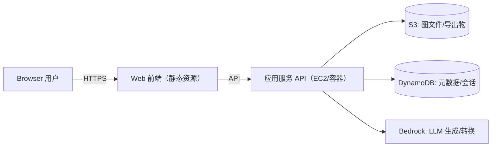

# Easy Draw（AI Drawio）系统原型说明

> 目标：实现一个「类 draw.io 的在线绘图编辑器 + 右侧 AI 助手」的网站，用于快速生成/编辑架构图，并支持保存、导出与再次编辑。

## 1. 原型界面（来自 PNG 的布局拆解）

页面为单页应用（SPA），整体三栏 + 顶部工具条布局：

```
┌────────────────────────── 顶部菜单/工具条 ──────────────────────────┐
│ 绘图 形状 格式 插入 删除 | 撤销/重做 | 缩放 |            [保存]      │
└───────────────────────────────────────────────────────────────────┘
┌───────────────┬──────────────────────── 画布区域 ───────────────────┬───────────────┐
│ 左侧：形状库    │ 网格画布/拖拽连线/选中编辑/缩放                      │ 右侧：AI 助手   │
│ - 搜索框        │ - 节点/连线                                          │ - 会话/提示词    │
│ - 分类列表      │ - 选中后的控制点/对齐线                               │ - 生成状态/模型   │
│ - 常用形状      │                                                      │ - 一键应用结果    │
└───────────────┴────────────────────────────────────────────────────┴───────────────┘
```

### 1.1 顶部菜单/工具条（Top Bar）
- 菜单：`绘图 / 形状 / 格式 / 插入 / 删除`（可下拉）
- 常用操作：撤销、重做、缩放（放大/缩小/适配）、保存
- 状态展示：当前文件名、是否已保存、缩放比例（如 60%）

### 1.2 左侧形状库（Shape Library）
- 搜索：按名称/标签检索形状
- 分类：`通用 / 杂项 / 高级 / 基本 / 箭头`（与 PNG 一致）
- 列表区：可拖拽到画布；支持收藏/最近使用
- 图标集：内置 **AWS 图标库**（用于快速画架构图）

### 1.3 画布区域（Canvas）
- 无限画布 + 网格背景（可开关）
- 节点/连线：拖拽创建、拉线连接、自动吸附到锚点
- 编辑：移动、缩放、旋转（按形状支持）、文本编辑、样式编辑（颜色/线宽/字体/阴影）
- 多选：框选、多选对齐/分布、组合/取消组合
- 历史：Undo/Redo（与 AI 变更同一套历史栈）

### 1.4 右侧 AI 助手（AI Panel）
- 产品入口：`easy draw`（原型右侧标题）
- 核心能力：
  - 文本生成图：输入一句话生成架构图/流程图
  - 图优化：自动对齐、布局美化、加标签、补齐缺失组件
- 交互：聊天式会话 + “生成图/完整”状态 + 一键应用到画布

## 2. 关键用户故事与交互流程

### 2.1 新建/编辑/保存
1. 用户打开编辑器 → 默认空画布（或最近文件）
2. 从左侧拖拽形状 → 画布生成节点
3. 拖拽锚点连线 → 生成边（Edge）
4. 点击 `保存` → 写入云端（S3 + DynamoDB），并在本地缓存最近版本

### 2.2 AI 生成图（从文本到可编辑图）
1. 用户在右侧输入需求（例如：“画一个用户访问 EC2，再访问 S3/Bedrock/DynamoDB 的架构图”）
2. 前端提交：`prompt + 当前画布摘要/选区信息 + 目标风格(AWS)` 给后端
3. 后端调用 LLM（Bedrock）→ 返回 **可执行的图变更指令**（不要直接返回图片）
4. 前端将变更指令转换为一次可撤销的事务（transaction）→ 应用到画布

## 3. 系统架构原型（与 PNG 中 AWS 组件对应）

> 原型建议采用 AWS 部署：Web 前端 + API 服务（EC2/容器）+ 对象存储 S3 + 元数据 DynamoDB + LLM Bedrock。



### 3.1 组件职责
- Web 前端：编辑器渲染、交互、离线缓存、AI 会话 UI、变更应用与撤销
- API 服务：
  - 鉴权/限流
  - 图文件 CRUD（签名 URL、版本管理）
  - AI 编排（将画布状态摘要化、调用 LLM、返回结构化指令）
- S3：存放图文件（`.json`/`.drawio`/`.svg`/`.png`）及导出产物
- DynamoDB：存放图的索引/权限、版本号、AI 会话记录（可选）
- Bedrock：生成图的结构化指令（节点/边/布局/样式）

## 4. 数据模型（前端与后端共识）

### 4.1 Diagram（图）
- `id`: string
- `title`: string
- `createdAt` / `updatedAt`: ISO string
- `version`: number（乐观锁）
- `canvas`: `{ width?: number; height?: number; grid: boolean; zoom: number }`
- `nodes`: Node[]
- `edges`: Edge[]
- `stylePreset`: `"aws" | "default" | ...`

### 4.2 Node（节点）
- `id`: string
- `type`: `"rect" | "ellipse" | "awsIcon" | "text" | ...`
- `position`: `{ x: number; y: number }`
- `size`: `{ w: number; h: number }`
- `label`: string
- `data`: `{ iconKey?: string; shapeProps?: object }`
- `style`: `{ fill?: string; stroke?: string; fontSize?: number; ... }`

### 4.3 Edge（连线）
- `id`: string
- `source`: nodeId
- `target`: nodeId
- `label?`: string
- `style`: `{ stroke?: string; dashed?: boolean; arrow?: "none"|"end"|"both" }`

### 4.4 AI Patch（AI 返回的变更指令）
- `operations`: Array<
  - `{ op: "addNode"; node: Node }`
  - `{ op: "addEdge"; edge: Edge }`
  - `{ op: "updateNode"; id: string; patch: Partial<Node> }`
  - `{ op: "deleteNode"; id: string }`
  - `{ op: "autoLayout"; algorithm: "dagre" | "elk" | "grid" }`
  - `{ op: "applyStylePreset"; preset: "aws" | "default" }`
>
- `explain`: string（给右侧面板展示的自然语言说明）

## 5. API 设计（建议）

### 5.1 图文件
- `GET /api/diagrams`：列表（分页）
- `POST /api/diagrams`：新建
- `GET /api/diagrams/:id`：读取（含版本）
- `PUT /api/diagrams/:id`：保存（带 `version`）
- `POST /api/diagrams/:id/export`：导出（png/svg/drawio）

### 5.2 AI
- `POST /api/ai/patch`
  - 输入：`{ prompt, diagramSnapshot, selection?, stylePreset }`
  - 输出：`AiPatch`

### 5.3 存储策略（推荐）
- 小图：Diagram JSON 直接存 DynamoDB（单条不超过 400KB）
- 大图：Diagram JSON 存 S3，DynamoDB 仅存索引与版本
- 写入：`PUT` 先写 S3（预签名），再写 DDB（更新版本与指针）

## 6. 前端技术栈（建议选型）

### 6.1 基础框架
- `Vue 2` + `JavaScript`（不使用 TypeScript）
- 构建/本地开发：`Vue CLI (Webpack)`（Vue2 生态更成熟；如需可再评估 `Vite + @vitejs/plugin-vue2`）
- 路由：`vue-router@3`（列表页/编辑页/设置页）
- 状态管理：`vuex@3`（编辑器状态：选区、历史栈、UI 面板状态）
- 请求：`axios`（统一拦截器、错误处理、重试/节流可按需封装）
- 代码质量：`ESLint` + `Prettier`

### 6.2 绘图引擎与布局
- 图编辑：优先 `@maxgraph/core`（mxGraph/Draw.io 同源技术路线，利于做“类 draw.io”体验）
- 自动布局：`dagre` 或 `elkjs`（用于 AI 自动排版与“美化布局”）
- 导出：`svg` 原生导出 + `html-to-image`（辅助生成 png）

### 6.3 UI 与样式
- UI 组件：`Element UI`（Vue2 生态成熟；用于表单、按钮、抽屉、消息提示）
- 样式：`SCSS`（配合 BEM/约定式命名）；如需原子化可选 `Tailwind CSS`（尽量避免多套方案混用）

### 6.4 协议与可观察性
- 通信：`REST`（先做原型）；后续可扩展 `WebSocket` 做协作
- 监控：前端埋点（操作耗时、导出失败率、AI 成功率）

## 7. 目录结构（前端建议）

```
src/
  main.js              # 应用入口
  router/              # 路由
  store/               # Vuex（含编辑器模块/AI 模块）
  layouts/             # 全局布局（顶部栏/三栏布局）
  views/               # 页面级视图（列表/编辑/设置）
  editor/              # 画布、形状库、工具条、历史栈
  ai/                  # 右侧 AI 面板、会话、patch 预览/应用
  api/                 # 请求封装与类型
  assets/icons/aws/    # AWS 图标集
  shared/              # 通用组件与工具
```

## 8. MVP 范围（第一期可交付）
- 画布：拖拽形状、连线、文本编辑、Undo/Redo、缩放、导出 PNG/SVG
- 保存：云端保存/加载、版本号控制、最近文件
- AI：从文本生成 AWS 架构图；将现有图一键转换为 AWS 风格；AI 变更可撤销
