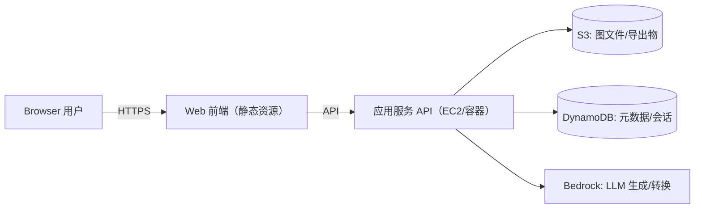

# Easy Draw（AI Drawio）系统原型说明

> 目标：实现一个「类 draw.io 的在线绘图编辑器 + 右侧 AI 助手」的网站，用于快速生成/编辑架构图，并支持保存、导出与再次编辑。

## 1. 原型界面（来自 PNG 的布局拆解）

页面为单页应用（SPA），整体为「左侧绘图编辑器（draw.io） + 右侧 AI 助手」两栏布局；draw.io 在 iframe 内提供菜单/工具条/形状库/画布等完整编辑体验。

```
┌────────────────────────── 顶部 App 栏（可选） ──────────────────────────┐
│ 品牌 + 文件名/版本（可选，仅展示状态）                                     │
└────────────────────────────────────────────────────────────────────────┘
┌────────────────────────── 左侧：draw.io 编辑器（iframe） ──────────────────────────┬───────────────┐
│ draw.io 内部 UI：菜单/工具条 + 形状库 + 画布 + 缩放/撤销/重做/样式面板等             │ 右侧：AI 助手   │
│ - 形状库搜索/分类（通用/杂项/高级/基本/箭头…）                                      │ - 会话/提示词    │
│ - 网格画布、拖拽连线、选中编辑、对齐线、样式编辑                                     │ - 生成状态/模型   │
│ - 内置导出/打印/导入等（可按需隐藏/接管）                                           │ - 一键应用结果    │
└───────────────────────────────────────────────────────────────────────────────┴───────────────┘
```

### 1.1 顶部 App 栏（可选）
- MVP 建议：尽量避免与 draw.io 内部菜单/工具条重复
- 建议仅做“应用级状态展示”：品牌、文件名/版本、未保存提示等
- 保存/导出等“文件级能力”优先使用 draw.io 内部 UI（避免重复实现/分裂入口）
- 撤销/重做/缩放等“画布级能力”优先使用 draw.io 自带 UI（或通过 postMessage 转发为快捷键/命令）

### 1.2 左侧绘图编辑器（Draw.io Embed）
- draw.io 作为“左侧整块编辑区”的承载者：同时覆盖原本的「形状库 + 画布区域」
- draw.io 内置能力：
  - 形状库：搜索、分类、拖拽、连接器等
  - 画布：网格/缩放、节点与连线编辑、对齐与分布、样式与文本编辑
  - 文件：导入/导出（svg/png/drawio）、页面管理等
- 应用与 draw.io 的边界：
  - 应用负责：接管 `save` 事件并将图保存为本地 `.drawio` 文件（弹出保存对话框选择路径；浏览器不支持时降级为下载到默认目录）、列表页与预览、AI 能力与“应用结果”
  - draw.io 负责：绝大多数交互编辑与渲染

### 1.3 自研画布的取舍（备选）
- MVP：以 draw.io embed 为主（见 6.2 方案 B），快速获得完整编辑器体验
- 后续增强：若必须实现“节点/边级别 AI Patch、协作、强约束布局”等深度能力，再迁移或并行引入 6.2 方案 A（`@maxgraph/core`）

### 1.4 右侧 AI 助手（AI Panel）
- 产品入口：`下一个AIDrawio`（右侧顶部栏，含“关于/提示/设置”等入口）
- 核心能力：
  - 文本生成图：输入一句话生成架构图/流程图
  - 图优化：自动对齐、布局美化、加标签、补齐缺失组件
- 交互与样式（参考右侧截图）：
  - 顶部栏：Logo + 标题 + `关于` + 提示图标 + 右侧快捷入口（新会话/账户/设置/更多）
  - 状态卡：`生成图 / 完整`（下拉可切换模式，例如“生成图/生成修改”）
  - 快捷按钮：`用AWS风格复制这个过程`（一键预填提示词）
  - 对话区：气泡式消息；AI 消息支持 `复制/反馈（赞/踩）`
  - 底部输入区：多行输入框 + `清空/造型开关/导出/上传` + `发送` 按钮；Enter 发送（Shift+Enter 换行）

## 2. 关键用户故事与交互流程

### 2.1 新建/编辑/保存
1. 用户打开编辑器 → 默认空画布（或最近文件）
2. 从左侧拖拽形状 → 画布生成节点
3. 拖拽锚点连线 → 生成边（Edge）
4. 点击 `保存` → 写入云端（S3 + DynamoDB），并在本地缓存最近版本

### 2.2 AI 生成图（从文本到可编辑图）
1. 用户在右侧输入需求（例如：“画一个用户访问 EC2，再访问 S3/Bedrock/DynamoDB 的架构图”）
2. 前端提交：
   - `format="drawio"`：`prompt + drawioXml + 目标风格(AWS)`（MVP 推荐）
   - `format="json"`：`prompt + diagramSnapshot/selection + 目标风格(AWS)`（后续增强）
3. 后端调用 LLM（Bedrock）→ 返回可应用的结果：
   - `format="drawio"`：返回新的 `drawioXml`（前端直接 reload 到 draw.io）
   - `format="json"`：返回结构化 operations（便于撤销/重做与精细控制）
4. 前端应用到画布：
   - MVP：一次 AI 变更 = 替换整图 XML
   - 增强：将 operations 作为一次可撤销事务应用

## 3. 系统架构原型（与 PNG 中 AWS 组件对应）

> 原型建议采用 AWS 部署：Web 前端 + API 服务（EC2/容器）+ 对象存储 S3 + 元数据 DynamoDB + LLM Bedrock。



### 3.1 组件职责
- Web 前端：编辑器渲染、交互、离线缓存、AI 会话 UI、变更应用与撤销
- API 服务：
  - 鉴权/限流
  - 图文件 CRUD（签名 URL、版本管理）
  - AI 编排（将画布状态摘要化、调用 LLM、返回结构化指令）
- S3：存放图文件（`.json`/`.drawio`/`.svg`/`.png`）及导出产物
- DynamoDB：存放图的索引/权限、版本号、AI 会话记录（可选）
- Bedrock：生成图的结构化指令（节点/边/布局/样式）

## 4. 数据模型（前端与后端共识）

### 4.1 Diagram（图）
- `id`: string
- `title`: string
- `createdAt` / `updatedAt`: ISO string
- `version`: number（乐观锁）
- `format`: `"json" | "drawio"`（推荐 MVP 先用 `drawio`，后续如需再演进 `json`）
- `canvas`: `{ width?: number; height?: number; grid: boolean; zoom: number }`
- `drawioXml?`: string（当 `format="drawio"` 时，存 `.drawio`/`mxfile` XML 源数据）
- `previewSvg?`: string（可选：保存时同步导出 SVG，用于列表缩略图/只读预览）
- `nodes?`: Node[]（当 `format="json"` 时使用）
- `edges?`: Edge[]（当 `format="json"` 时使用）
- `stylePreset`: `"aws" | "default" | ...`

### 4.2 Node（节点）
- `id`: string
- `type`: `"rect" | "ellipse" | "awsIcon" | "text" | ...`
- `position`: `{ x: number; y: number }`
- `size`: `{ w: number; h: number }`
- `label`: string
- `data`: `{ iconKey?: string; shapeProps?: object }`
- `style`: `{ fill?: string; stroke?: string; fontSize?: number; ... }`

### 4.3 Edge（连线）
- `id`: string
- `source`: nodeId
- `target`: nodeId
- `label?`: string
- `style`: `{ stroke?: string; dashed?: boolean; arrow?: "none"|"end"|"both" }`

### 4.4 AI Patch（AI 返回的变更指令）
- 当 `format="json"`：返回结构化 operations（便于撤销/重做与精细控制）
  - `operations`: Array<
    - `{ op: "addNode"; node: Node }`
    - `{ op: "addEdge"; edge: Edge }`
    - `{ op: "updateNode"; id: string; patch: Partial<Node> }`
    - `{ op: "deleteNode"; id: string }`
    - `{ op: "autoLayout"; algorithm: "dagre" | "elk" | "grid" }`
    - `{ op: "applyStylePreset"; preset: "aws" | "default" }`
  >
- 当 `format="drawio"`（MVP 更现实）：AI 直接返回一份新的 `drawioXml`（前端加载进 draw.io 编辑器）
  - `drawioXml`: string
- `explain`: string（给右侧面板展示的自然语言说明）

## 5. API 设计（建议）

### 5.1 图文件
- `GET /api/diagrams`：列表（分页）
- `POST /api/diagrams`：新建
- `GET /api/diagrams/:id`：读取（含版本）
- `PUT /api/diagrams/:id`：保存（带 `version`）
- `POST /api/diagrams/:id/export`：导出（png/svg/drawio）

### 5.2 AI
- `POST /api/ai/patch`
  - 输入（建议按 format 区分）：
    - `format="drawio"`：`{ prompt, drawioXml, selectionHint?, stylePreset }`
    - `format="json"`：`{ prompt, diagramSnapshot, selection?, stylePreset }`
  - 输出：`AiPatch`（见 4.4）

### 5.3 存储策略（推荐）
- 小图：Diagram JSON 直接存 DynamoDB（单条不超过 400KB）
- 大图：Diagram JSON 存 S3，DynamoDB 仅存索引与版本
- 写入：`PUT` 先写 S3（预签名），再写 DDB（更新版本与指针）

## 6. 前端技术栈（建议选型）

### 6.1 基础框架
- `Vue 2` + `JavaScript`（不使用 TypeScript）
- 构建/本地开发：`Vue CLI (Webpack)`（Vue2 生态更成熟；如需可再评估 `Vite + @vitejs/plugin-vue2`）
- 路由：`vue-router@3`（列表页/编辑页/设置页）
- 状态管理：`vuex@3`（编辑器状态：选区、历史栈、UI 面板状态）
- 请求：`axios`（统一拦截器、错误处理、重试/节流可按需封装）
- 代码质量：`ESLint` + `Prettier`

### 6.2 绘图引擎与布局
- 方案 B（推荐 MVP）：嵌入 `diagrams.net（draw.io）` 编辑器进行渲染与编辑
  - 前端用 `iframe` 打开 embed 模式，通过 `postMessage` 与编辑器通讯（加载/保存/导出）
  - 布局约束：draw.io iframe 覆盖“左侧整块编辑区”（包含形状库 + 画布），应用只保留右侧 AI 面板与少量应用级操作
  - 存储以 `.drawio` 的 `mxfile` XML 为主（`drawioXml`），可选在保存时导出 `previewSvg` 用于列表缩略图
  - 导出：通过 embed API 请求导出 `svg/png`（前端拿到导出结果后上传 S3），或由后端提供导出中转
  - 代价/限制：对图元的“程序化细粒度操作”不如自研引擎顺手；AI 变更更适合“生成整图 XML 并重载”，撤销粒度通常变粗
- 方案 A（后续增强）：基于 `@maxgraph/core` 自研/深度集成画布
  - 优点：AI Patch 可精确到节点/边级别并复用同一套历史栈；更易做协作、约束布局与自定义交互
  - 需要投入：画布交互、选择/对齐、连线规则、导出、性能优化等都需要自研
- 自动布局（可选）：`dagre` 或 `elkjs`（用于 AI 自动排版与“美化布局”，方案 A 更容易落地）

#### 6.2.1 `diagrams.net（draw.io）` Embed 集成要点（建议）
- 访问方式：
  - 快速验证：直接使用官方 `embed.diagrams.net`（依赖外网与可用性）
  - 生产/内网：建议自托管 diagrams.net 静态站点（与业务同域，避免跨域与可用性风险）
- 通讯模型：`iframe` + `window.postMessage`
  - 前端发：`load`（加载已有 `drawioXml`）、`export`（导出 `svg/png`）、`save`（触发保存）
  - 前端收：`save`（拿到最新 `drawioXml`）、`export`（拿到导出结果）、`exit`/`error`
  - 实现时需校验 `origin`，并对消息做白名单过滤（避免被任意页面 postMessage 注入）
- 刷新/重载策略（原型默认）：
  - 刷新页面或 draw.io iframe 重载时：清空左侧画布（加载空白 `drawioXml`），并重置右侧 AI 会话状态
- 保存策略（原型默认）：
  - 用户在 draw.io 内点击保存 → iframe 发送 `save` 事件携带 `drawioXml`
  - 应用弹出“保存到本地”对话框（优先 `File System Access API`），保存为 `.drawio` 文件；不支持时降级为浏览器下载
- AI 接入建议（MVP）：
  - 从编辑器获取当前 `drawioXml` → 传给后端与 `prompt`
  - 后端让 LLM 输出“完整的新 `drawioXml`”（而不是细粒度操作），前端直接 `load` 回编辑器
  - 取舍：实现快、鲁棒性取决于 XML 生成质量；撤销/重做粒度通常只能做到“一次 AI 变更 = 一次整体替换”

### 6.3 UI 与样式
- UI 组件：`Element UI`（Vue2 生态成熟；用于表单、按钮、抽屉、消息提示）
- 样式：`SCSS`（配合 BEM/约定式命名）；如需原子化可选 `Tailwind CSS`（尽量避免多套方案混用）

### 6.4 协议与可观察性
- 通信：`REST`（先做原型）；后续可扩展 `WebSocket` 做协作
- 监控：前端埋点（操作耗时、导出失败率、AI 成功率）

## 7. 目录结构（前端建议）

```
src/
  main.js              # 应用入口
  router/              # 路由
  store/               # Vuex（含编辑器模块/AI 模块）
  layouts/             # 全局布局（顶部栏/三栏布局）
  views/               # 页面级视图（列表/编辑/设置）
  editor/              # draw.io iframe 容器与通讯封装、应用级快捷键/状态
  ai/                  # 右侧 AI 面板、会话、patch 预览/应用
  api/                 # 请求封装与类型
  assets/icons/aws/    # AWS 图标集
  shared/              # 通用组件与工具
```

## 8. MVP 范围（第一期可交付）
- 画布：拖拽形状、连线、文本编辑、Undo/Redo、缩放、导出 PNG/SVG
- 保存：云端保存/加载、版本号控制、最近文件
- AI：从文本生成 AWS 架构图；将现有图一键转换为 AWS 风格；AI 变更可撤销

## draw启动
npx serve -l 8085